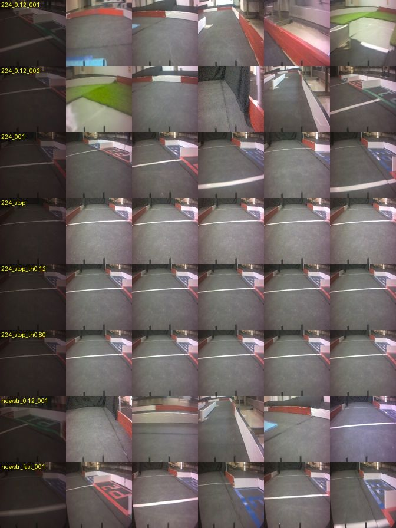

# 実機ログ 2026-09-27 — 224×224・60 fps・IMU 120 Hz

PS5 コントローラで手動記録した 8 セッション・合計約 7 分。画像 224×224・60 fps、IMU (SY-151・MPU-6500 互換) は画像と独立に 120 Hz で加速度＋ジャイロ。
名前に `stop` が付く 3 本は **車体を止めたまま、スロットルを 0・−0.12・−0.80 の一定値**にしたもの (画像が動かず、重力の向きも 3 本で同じ)。
データは sim PC の `~/jetracer/data/real_260927/224_224/` (リポジトリには入れない)。各 run に `meta.txt`・`log.csv`・`images/`。

左端は各セッションの先頭フレーム。自動露出の立ち上がりで暗い (下の「共通」)。

## セッションと使える範囲

| セッション | 内容 | 長さ | フレーム | 状態 |
|---|---|---|---|---|
| `224_001` | 手動走行 (スロットル −0.10〜−0.22) | 87.5 s | 5,218 | 完全 |
| `224_0.12_001` | 走行・スロットル −0.12 一定 | 63.6 s | 3,795 | **末尾欠け**: 最後の 231 枚 (#3564〜3794・3.9 s) の JPEG が無い。9/12 と同じ型。終端でスロットル +0.5 が 0.5 s |
| `224_0.12_002` | 走行・スロットル −0.12 一定 | 35.3 s | 2,107 | **破損**: CSV の末尾が NUL 1,675 byte、画像 #1547〜3769 の 2,223 枚が 0 byte (書き込み途中の電源断の型)。**使えるのは #0〜1546 (約 26 s)**。meta の session 名は `run_20260927_224_003` |
| `newstr_0.12_001` | 走行・スロットル −0.12 一定 | 85.0 s | 5,072 | 完全。IMU の読み失敗 6 回 (`imu_ok=0`・NaN の 1 行、約 14 s に 1 回) |
| `newstr_fast_001` | 走行 (スロットル −0.18 前後) | 47.7 s | 2,848 | 完全。ジャイロ z が ±250 dps で 0.5 % 飽和 |
| `224_stop` | 静止・スロットル 0 | 35.2 s | 2,101 | 完全 |
| `224_stop_th0.12` | 車体静止・スロットル −0.12 一定 | 35.0 s | 2,087 | 完全 |
| `224_stop_th0.80` | 車体静止・スロットル −0.80 一定 | 34.2 s | 2,042 | 完全 |

共通:
- 先頭の約 0.5 s (30 フレーム) は自動露出の立ち上がりで、明るさ平均が 37 → 118 と変わる。**学習では先頭 1 s を捨てる**。
- 各セッションの最後の 1 枚は CSV に行が無い (無害)。1 行目は画像が付く前の IMU の行 (`frame_id` 空)。
- 先頭フレームのファイル名は値が `nan` (画像が先に保存された)。
- 読み込み側では **0 byte の画像と NUL を含む行を捨てる**検査を常に入れる。

## 時刻と周期 (全セッション)

| 項目 | 実測 | 読み |
|---|---|---|
| IMU の周期 | 120.0 Hz。間隔の中央値 8.33 ms・p99 ≤ 10.3 ms・最大 13.3 ms。`missed_ticks_total` 0 | PCA9685 と同じ I2C バスでも崩れていない (設計 未決①) |
| 画像の周期 | 59.6〜59.7 fps。間隔の中央値 16.8 ms・最大 21.6 ms。25 ms 超の途切れ 0 | |
| 画像と IMU の時刻差 | `image_dt_ms` (IMU 読み完了 − フレーム読み完了) 中央値 10.5〜11.0 ms・最大 26.7 ms | どちらもホストの読み出し時刻。露光からの遅れは LED 試験かヨーレートの相互相関で別に出す |
| 時計 | `t_imu_mono`・`t_frame_mono` が単調時計、`t_*` が壁時計 | 同期の設計の「時計を 1 本」は満たした |

## IMU — 静止 (`224_stop`・35 s)

| 量 | x | y | z | 備考 |
|---|---|---|---|---|
| ジャイロのゼロ点 [dps] | −1.29 | +2.54 | +0.47 | stop の 3 本で ±0.05 dps 以内に一致。y の 2.5 dps は 13 s で 33°。起動時に 1〜2 s 静止して引く |
| 加速度の平均 [g] | −0.053 | +0.012 | −0.976 | \|g\| = 0.978 (2.2 % 小さい)。x の −0.05 g は 9/12 の −0.09 g より小さい。傾きかゼロ点かは 6 面静置で分ける |
| 加速度の標準偏差 [m/s²] | 0.020 | 0.020 | 0.033 | 帯域 60 Hz の白色と見なして **0.0026 / 0.0026 / 0.0043 m/s²/√Hz** |
| ジャイロの標準偏差 [dps] | 0.12 | 0.12 | 0.11 | 同様に **約 2.7×10⁻⁴ rad/s/√Hz** |

`imu_sim.yaml` との比較: `accel_nd: 0.0040` は実測と同程度。**`gyro_nd: 0.00009` は実測の約 1/3** で、sim のジャイロがきれいすぎる。
雑音密度は DLPF の設定が meta に無いので暫定 (DLPF が 60 Hz より狭いと過小評価)。35 s ではランダムウォークとバイアス不安定性は出ないので、静止 10 分は引き続き要る。
ゼロ点は 1 回の電源投入分なので、`turn_on_bias.*_sigma` (電源の入れ直し間のばらつき) にはまだ使えない。

## IMU — 車体静止でモータを回す (振動)

rms は加速度 m/s²、ジャイロ dps。120 Hz に揃えて Welch (1024 点) でピーク。

| スロットル | ax | ay | az | gx・gy | 最大のピーク |
|---|---|---|---|---|---|
| 0 (静止) | 0.02 | 0.02 | 0.03 | 0.12 | — |
| −0.12 | 0.60 | 0.59 | 0.67 | 2.3 | 16 Hz (見かけ) |
| −0.80 | 2.99 | 1.47 | 3.08 | 7〜9 | 38 Hz (見かけ) |
| 比較: 走行 −0.12 (`224_0.12_001`) | 3.6 | 1.6 | 3.2 | — | — |

- 同じスロットル −0.12 で、走行中の上下振動 3.2 m/s² のうち駆動系 (モータ・ギヤ・ファン) 由来は 0.67 m/s²、分散で 5 % 未満。**走行中の振動はほぼ路面由来**で、`vibration.surface` を 9/12 の路面別の値で置いた判断と合う。駆動系の振幅は `vibration.amp_ms2` の目安になる。
- 120 Hz のナイキストは 60 Hz。モータの回転は折り返して見えているはずで、16 Hz・38 Hz は真の周波数ではない。`motor_hz_per_mps`・`gear_mesh_hz` を出すには、**持ち上げ回転だけ 1 kHz で数秒ずつ**取り直す (FIFO か、ロガーの IMU レートを一時的に上げる)。スロットルは 3〜4 段。

## 走行ログから

| 項目 | 9/27 | 9/12 | 読み |
|---|---|---|---|
| 直進時の舵 (ヨーレートがほぼ 0 の区間の中央値) | −0.07〜−0.11 (`224_*`)、−0.01〜−0.04 (`newstr_*`) | −0.20〜−0.24 | 中立に寄った。meta の `steering_offset` は 0.12 のままなので、リンケージ側で合わせたと読める |
| 舵の飽和 | −1 が 15〜27 %、+1 が 2〜9 % | −1 が 13〜24 % | 左の張り付きは減っていない。トリムより δmax 不足の可能性。その区間の教師は切れている |
| 加速度の飽和 (±2 g) | 全サンプルの 1.3〜2.2 % | az で 130 フレーム | ±4 g に |
| ジャイロの飽和 (±250 dps) | `newstr_fast` で 0.5 %、他も最大 211〜244 dps | (ジャイロ無し) | ±500 dps に。速く走るほど切れる |

## 旋回中の速度と旋回半径 (ジャイロで初めて出た)

横加速度 a (ax、ゼロ点 −0.053 g を引く) とヨーレート ω (gz、ゼロ点 +0.47 dps を引く) を 0.2 s 平均し、|ω| > 1 rad/s・前進中の区間で
v = a / ω、R = a / ω²。a と ω の符号は 99 % で一致 (軸の取り方と整合)。

| セッション | 旋回中の速度 (中央値・四分位) | 左フルロックの R | 右フルロックの R | 等価な舵角 (L 0.257 m) |
|---|---|---|---|---|
| `224_001` | 1.22 m/s (1.01〜1.44) | 0.94 m | 0.70 m | 左 15° / 右 20° |
| `224_0.12_001` | 1.61 m/s (1.35〜2.06) | 1.01 m | 0.76 m | 左 14° / 右 19° |
| `newstr_0.12_001` | 1.66 m/s (1.33〜1.95) | 0.84 m | 0.63 m | 左 17° / 右 22° |
| `newstr_fast_001` | 2.47 m/s (1.76〜2.86) | 0.84 m | 0.77 m | 左 17° / 右 19° |

- 旋回中の速度はスロットル −0.12 で 1.4〜1.7 m/s。9/12 の周回平均 (−0.12 → 2.0 m/s) と同じ桁で、旋回で遅くなる分と整合。
- **フルロックでも R 0.63〜1.01 m**。等価な舵角は 14〜22° で、`vehicle_profile.delta_max_rad` の暫定 27° (R_min 0.506 m) より小さい。
  1〜2 m/s でのタイヤの滑り (アンダーステア) と IMU のてこ腕を含む実効値なので幾何の δmax ではないが、**sim の曲がりやすさは実機より楽観的な可能性が高い**。
- **左が右より曲がらない** (R が 1.2〜1.3 倍)。左の −1 張り付きが多いことと合う。δmax を左右別に、低速 (0.3 m/s 以下) で実測するのが次。
- 横偏差 (壁からの距離) はまだ出ない。画像の壁検出か、ヨーレートの積分とコース図の当てはめが要る。

## ロガーへの要望 (9/12 から) の状況

| 要望 | 状況 |
|---|---|
| ジャイロ 3 軸 | 済 (dps) |
| 停止時に画像キューをフラッシュ | **未**。2 本で末尾が欠けた。1 本は電源断型なので、停止時に `flush`＋`os.fsync`、電源を切る前に `sync` (または 1 秒ごとに fsync) |
| レンジ ±4 g 以上 | **未** (±2 g)。ジャイロも ±500 dps に |
| IMU を画像と独立に 100 Hz | ほぼ済 (独立 120 Hz・欠け 0)。FIFO ではなくホスト読み出し時刻で、同じ CSV に最新画像を紐付ける形。学習の結合には十分 |
| meta にカメラのパイプラインと取付向き | 一部。IMU の型・レンジ・時刻の意味は入った。カメラのパイプライン (センサモード・切り出しか縮小か)・DLPF・取付向きはまだ |

## 残る判断: 画像 60 fps と sim の 15 Hz

`/camera/image_raw` の凍結値は 224×224・15 Hz で、sim の Unity もその周期で描いている。① 推論は 15 Hz のまま、実データは 4 枚に 1 枚で使う (sim は変更なし)、② 推論を 30 Hz 以上にして sim の描画周期も上げる (2 ホストで描画 64 ms が上限になりうる)。先に ① で実機の方策を確かめ、足りなければ ② が安い。記録は 60 fps のまま続ければどちらにも使える。
